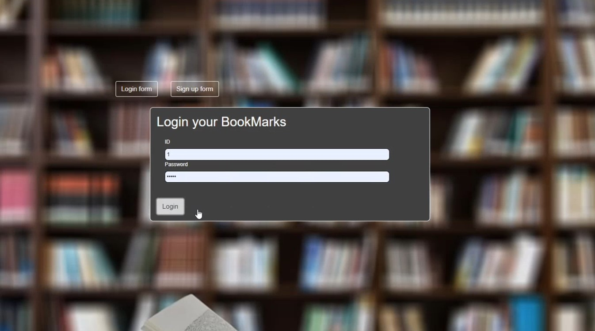
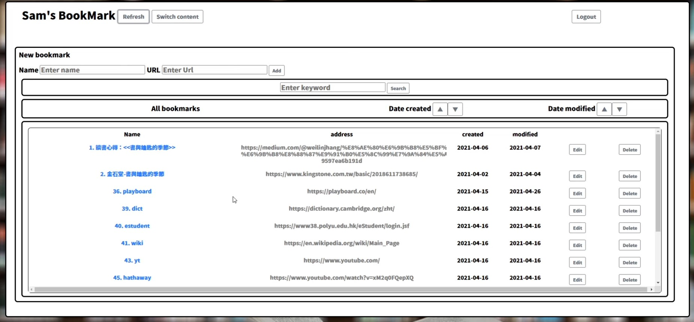
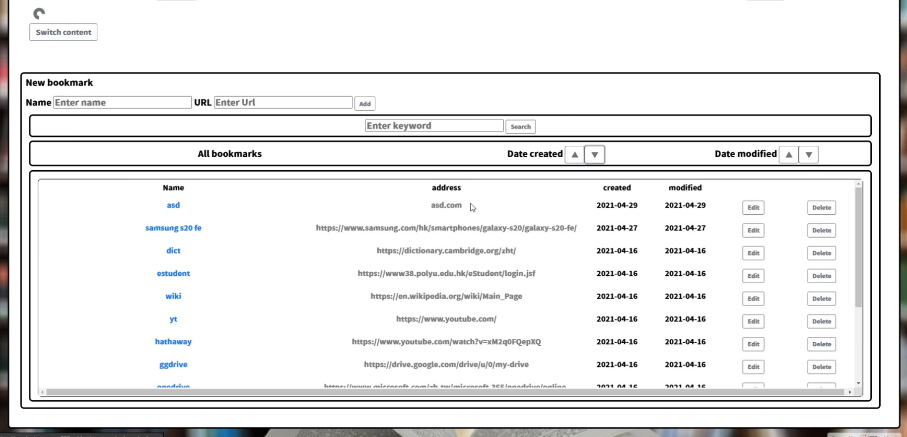
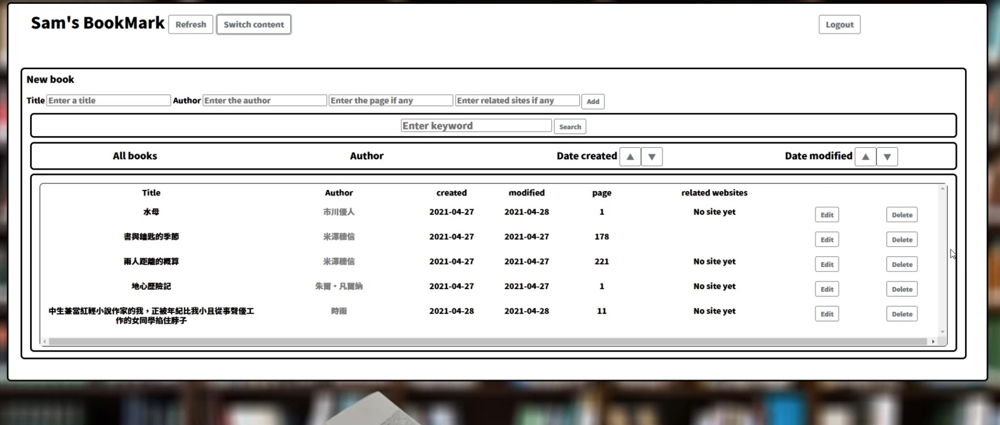
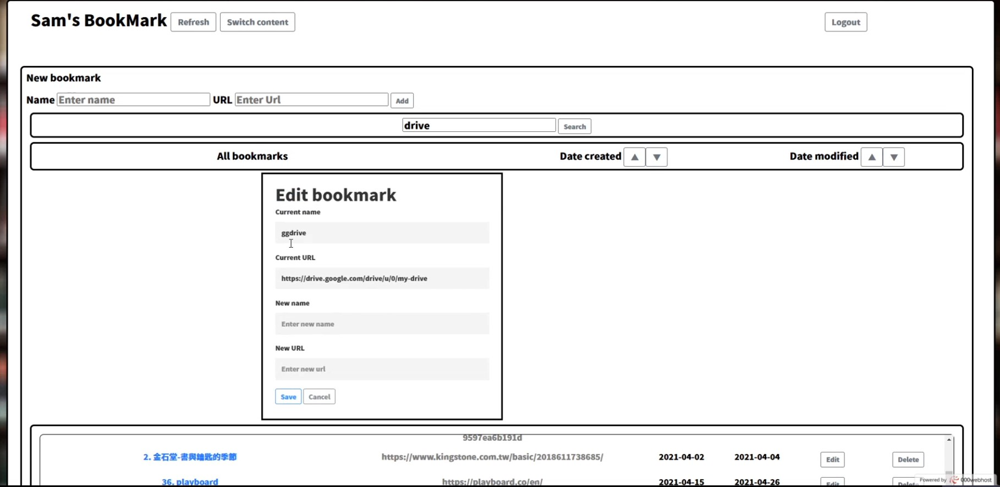
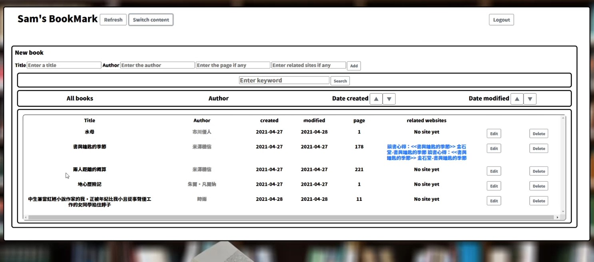

# BookMarks - The Advanced web bookmark application

## Introduction
Bookmarks in browsers can help users to save website links so that they do not need to write it down on paper, docs or memorize them. They are convenient to use because the links can be displayed on the top of browsers and the user can open or edit the bookmark directly.

However, the current Edge and Chrome bookmarks lack specific sorting functions such as searching by date created or date modified. New bookmarks are added to the bottom of the list most of the time. When there are hundreds of bookmarks, the time spent on rolling to the bottom will be long enough. Moreover, it is not efficient to move it to the top every time.

To tackle the issue, a new bookmarks application is introduced. The primary function of the application is to bookmark and sort websites. One secondary function proposed is to work as a book database. Passionate book readers often search for information about books they are reading on the Internet. The application can maintain the book information online and link to bookmarks so that users can find the links by a book title. The title of the application “BookMarks” combines bookmarks and books.

## Main components and functionalities
| Filename  /  folder name        | Description|
| ------------- |:-------------:| 
| index.php      | The index page of the system. Execute and accept login and signup logic. | 
| home.php | The home page of the application. Display user information and listen to user requests.|
| style.css|Stores the style of the index page|
|style_home.css|Stores the style of the home page|
|file.js| JavaScript functions to execute different queries|
|conn_test.php | Set up connection to the database|
|image|Pictures used by BookMarks|

The remaining .PHP files execute different queries when called. Details in `image/readme/php-details-#.jpg` 

## UI
#### Index page

#### Home - bookmarks page

#### Home - bookmarks page when sorted By Date Created

#### Home - book page

#### Edit a bookmarks

#### Books with links

